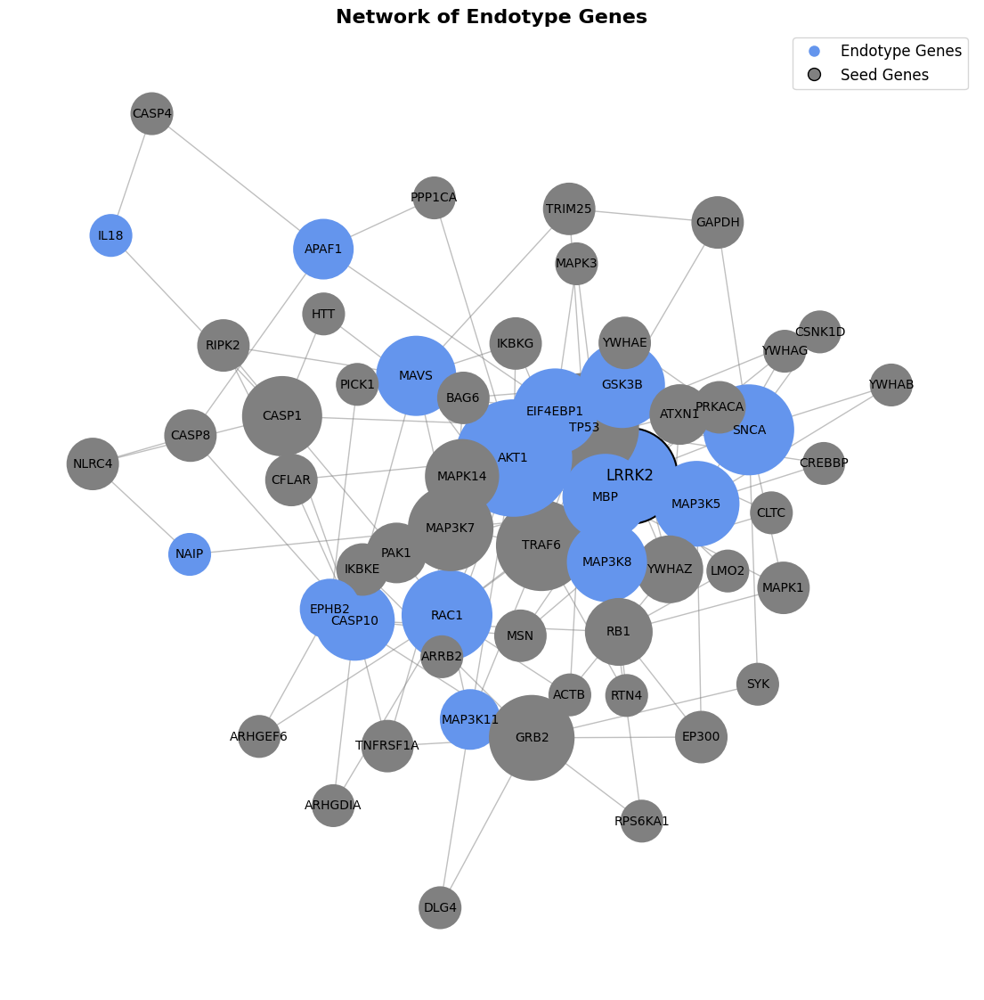

# EndotypY

A short description of your package.

## Installation

```sh
#clone git repo and navigate to directory containing the setup.py file
pip install .

#or run this command in your jupyter notebook
!pip install git+https://github.com/menchelab/EndotypY.git
```

## Documentation

[View the full documentation here](https://menchelab.github.io/EndotypY/)

## Usage

#### import
```python
import EndotypY as edy
```

#### create endotyper object and read in network and seed genes
```python
endo = edy.Endotyper()

path_network = <path_to_network_file.tsv>
path_seed = <path_to_seed_file.txt>

endo.import_network(path_network)
endo.import_seeds(path_seed)
```

#### prepare RWR
```python
endo.prepare_rwr(r=0.8)

```

#### explore the seed clusters
```python
#k is the size of the neighborhoods to explore
endo.explore_seed_clusters(scaling=True, k=50)
```

#### extract a connected disease module based on seeds
```python
endo.extract_disease_module(seed_cluster_id = None, scaling=True, k=200)
```

#### explore the local neighborhood around all seeds
```python
endo.define_local_neighborhood(scaling=True, neighbor_percentage=1)
```

#### annotate the local neighborhoods with gene set enrichment
```python
endo.annotate_local_neighborhood(enrichr_lib='GO_Biological_Process_2023',
                                 organism='Human',
                                 sig_threshold=0.05)
```

#### find endotypes
```python
endo.define_endotypes()
```

#### visualise a single endotype
```python
endo.plot_endotype(iteration=1, cluster_id=2, node_size='betweenness', path_length=3)
```


#### visualize the network

```python
endo.visualize_network()
```




#### visualize all endotypes
```python
endo.plot_multiple_endotypes(node_size='degree', path_length=2)
```

