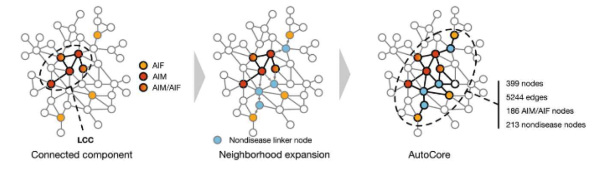
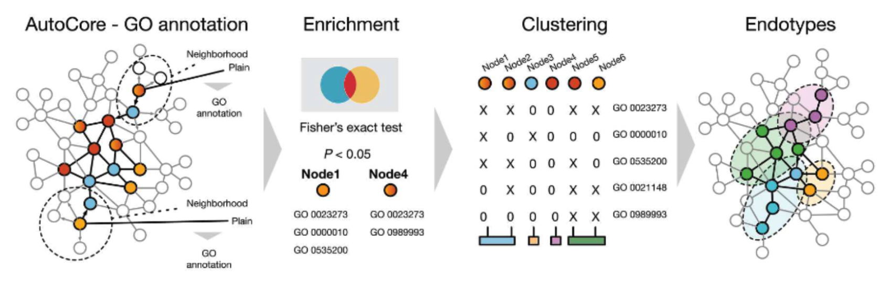

The Concept of Endotyping
=========================

Dissecting diseases into mechanistic-based molecular subtypes,
so called endotypes, offer a more molecularly accurate and
therapeutically actionable understanding of the pathomechanisms of diseases
and their potential therapeutic interventions.
Our custom endotyping pipeline enables us to detect disease relevant subnetworks
within the protein-protein interaction network and partition this network into molecular endotypes.
The endotypes are phenotypically and molecularly cohesive, meaning they can be used to define
patient subgroups within heterogeneous diseases which are more homogenous, and thus achieve
more effective stratification for determining therapeutic targets.

Step 1. Given a set of disease related genes, a connected subnetwork is defined using
a random walk with restart on the protein-protein interaction network, incrementally
adding additional nodes in order of their visiting probabilities until the subgraph contains
no disconnected nodes. This approach identifies key genes more efficiently than simply combining
literature annotated disease gene sets.

Step 2. Define the immediate network neighborhood of each gene in the subnetwork and determine
a set of significantly enriched functional terms for each neighborhood. By applying
hierarchical clustering to the resulting gene x functional enrichment matrix, the endotypes are
obtained and can be mapped back onto the subnetwork. This procedure leverages both the connectivity
patterns within the PPI-derived subnetwork, and detailed functional annotations of the individual genes.
Therefore, the endotypes represent subclusters of a disease defined by physical molecular interactions
as well as molecular and functional similarity.

Guthrie, J. et al. AutoCore: A network-based definition of the core module of human autoimmunity and autoinflammation. Sci Adv 9, eadg6375 (2023).